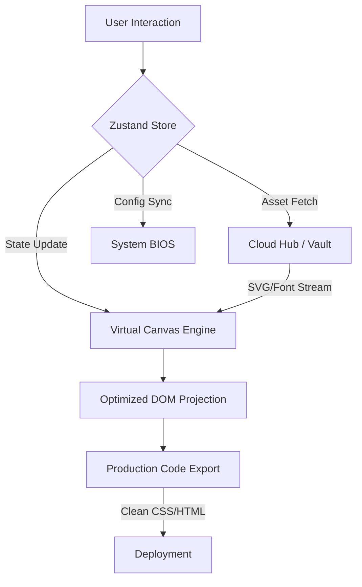

# KRAFT 🪐 | Absolute Interaction Engine v2.0


**KRAFT** is a high-fidelity, state-driven visual interaction engine built for creative teams who demand absolute structural control. Unlike traditional tools, KRAFT treats design as a live logic tree, eliminating the translation gap between visual mockups and production-ready code.

---

## 🛠️ System Architecture & Workflow

KRAFT operates on a "Single Source of Truth" architecture, where the visual canvas is a direct projection of the global state.



### Core Pipeline:
1.  **State-Driven Interaction**: Every drag, resize, and style change is processed through a high-performance Zustand store.
2.  **Virtual Layering**: Objects are managed in a non-destructive hierarchy, allowing for instant reordering and grouping.
3.  **Cloud Vault Engine**: A massive repository of 10k+ assets is served via a lookup system for zero-lag retrieval.
4.  **Absolute Export**: Our compiler translates the state tree into pixel-perfect, framework-agnostic CSS/HTML.

---

## 📂 Project Structure

```bash
KRAFT/
├── src/
│   ├── app/
│   │   └── routes/          # High-level page components (Landing, Docs, Privacy)
│   ├── components/
│   │   ├── canvas/          # Core editing engine & viewport logic
│   │   ├── common/          # Reusable UI (Modals, Buttons, System Settings)
│   │   ├── dashboard/       # Cloud Hub & Project Management
│   │   ├── editor/          # Sidebars, Toolbars, and Property Panels
│   │   ├── landing/         # Interactive marketing sections
│   │   └── layout/          # Global navigation & footer
│   ├── store/
│   │   └── useEditorStore.js # Global State (The "Brain")
│   ├── utils/
│   │   └── iconUtils.js     # Logic for resolving 10k+ brand assets
│   └── App.jsx              # Main Router & Theme Provider
├── .env                     # Environment Configuration (GitIgnored)
├── tailwind.config.js       # Neo-Brutalist Design Tokens
└── package.json
```

---

## 🔑 Key Files Explained

### `useEditorStore.js`
The central nervous system. It manages everything from element positions to theme states and user preferences. It ensures that your workspace persists across sessions using local storage hydration.

### `iconUtils.js`
The high-fidelity asset pipeline. It maps search terms to vector paths for 10,000+ icons and brand logos, ensuring the "Brand Central" engine works instantly via the integrated `simple-icons` system.

---

## 🗺️ Project Roadmap

### 🚀 Completed
- [x] **Neo-Brutalist Design System**: Solid shadows, high-contrast HSL palettes.
- [x] **Cloud Vault v2.0**: Integrated 10k icons and brand logos with instant sync.
- [x] **System BIOS Modal**: Interactive hardware acceleration and animation controls.
- [x] **Full Responsiveness**: Optimized for Mobile, Tablet, and Ultra-wide monitors.

### 🛠️ In Progress (Phase 3)
- [ ] **Advanced Layering**: Multi-select, grouping, and layer-locking logic.
- [ ] **Smart Alignment**: Real-time magnetic guides for pixel-perfect placement.
- [ ] **PDF/PNG Export**: High-resolution bitmap and vector document exports.

### 🌐 Future (Phase 4)
- [ ] **Real-time Collaboration**: Multi-user editing via WebSocket sync.
- [ ] **Asset Marketplace**: Community-contributed design fuel.

---

## 🚀 Getting Started

1. **Install Dependencies**:
   ```bash
   npm install
   ```

2. **Run Development Server**:
   ```bash
   npm run dev
   ```

3. **Open Studio**:
   Navigate to `localhost:5173` and click "Launch Studio" to engage the engine.

---
*Built with Absolute Precision by the KRAFT Team*
