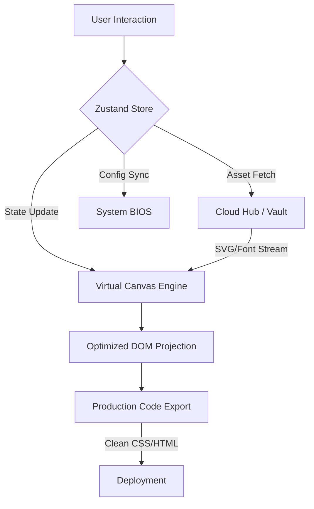

# KRAFT 🪐 | Absolute Interaction Engine v2.0


**KRAFT** is a high-fidelity, state-driven visual interaction engine designed for creative teams who demand bold aesthetics and absolute structural control. Built on a Neo-Brutalist design philosophy, KRAFT bridges the gap between raw creative intent and pixel-perfect production reality.

---

## ⚡ Core Philosophy: Design Beyond Compromise

KRAFT isn't just a tool; it's a rebellion against the "boring" web. We prioritize:
- **Neo-Brutalist Aesthetics**: High-contrast HSL palettes, solid shadows, and bold typography (Outfit, Inter, Editorial).
- **Absolute Interaction**: Every element is a live node in a state-driven logic tree.
- **State-Driven Integrity**: Powered by a high-performance Zustand engine for zero-latency workspace hydration.
- **Cyber-Vault Infrastructure**: Instant access to 10k+ assets, fonts, and brand logos.

---

## 🛠️ System Modules

### 1. The Design Studio
The heartbeat of KRAFT. A high-fidelity canvas featuring:
- **Dynamic Layering**: Non-destructive hierarchy management.
- **Magnetic Guides**: Real-time alignment for geometric precision.
- **Universal Toolbar**: Quick-access shapes, text engines, and asset injectors.

### 2. Cloud Hub (Cyber-Vault)
A premium dashboard serving as a centralized asset repository:
- **10,000+ Icons**: Integrated `lucide-react` and `simple-icons` lookup.
- **100+ Curated Fonts**: Professional typography selection.
- **AI-Generated Fuel**: 20+ specialized assets for rapid prototyping.
- **Auto-Purge Logic**: Optimized 12-hour asset lifecycle management with toggleable controls.

### 3. System BIOS & Control Center
A deep-level configuration modal for hardware-level control:
- **Animation Speed**: Global control over UI transitions.
- **GPU Acceleration**: Toggleable performance modes.
- **Workspace Prefs**: Custom grid sizes and snapping sensitivity.

### 4. The Manifesto
An integrated design philosophy section that defines the KRAFT ethos: "Kill the Boring." It features interactive Neo-Brutalist cards and high-impact typography.

---

## 📂 Project Architecture

### Data Flow & Workflow
KRAFT operates on a **Single Source of Truth** architecture. The visual canvas is a direct projection of the global Zustand state.



### Directory Structure
```bash
KRAFT/
├── src/
│   ├── app/
│   │   └── routes/          # Landing, Editor, Docs, Privacy, Dashboard
│   ├── components/
│   │   ├── canvas/          # Viewport logic & element rendering
│   │   ├── common/          # Modals, Buttons, BIOS, Identity System
│   │   ├── dashboard/       # Cloud Hub & Asset Management
│   │   ├── editor/          # Sidebars, Properties, Toolbars
│   │   ├── landing/         # Marketing Sections (Manifesto, Features)
│   │   └── layout/          # Global Navigation & Footer
│   ├── store/
│   │   └── useEditorStore.js # Central "Brain" (Zustand)
│   ├── utils/
│   │   └── iconUtils.js     # 10k+ Asset Resolution Pipeline
│   └── index.css            # Design System (Tailwind + Custom Tokens)
├── tailwind.config.js       # Neo-Brutalist Theme Configuration
└── vite.config.js           # Engine Build Pipeline
```

---

## 🚀 Tech Stack

- **Core**: React 18 + Vite
- **State**: Zustand (with Persist Middleware)
- **Styling**: Tailwind CSS + `tailwindcss-animate`
- **Icons**: Lucide React + Simple Icons
- **Fonts**: Google Fonts (Outfit, Inter) + Custom Editorial
- **Animations**: Optimized CSS Keyframes & Tailwind Transitions

---

## 🏁 Getting Started

1. **Clone & Install**:
   ```bash
   npm install
   ```

2. **Launch Dev Engine**:
   ```bash
   npm run dev
   ```

3. **Open Studio**:
   Navigate to `localhost:5173` and click **Launch Studio**.

---

## 🗺️ Development Roadmap

### ✅ Completed
- [x] **Neo-Brutalist Design System**: Solid shadows, high-contrast HSL.
- [x] **Cloud Vault v2.0**: 10k+ assets with instant search.
- [x] **System BIOS**: Interactive hardware acceleration controls.
- [x] **Manifesto Section**: High-impact marketing integration.
- [x] **Full Responsiveness**: Optimized for all device classes.

### 🚧 In Progress
- [ ] **Advanced Layering**: Multi-select and grouping logic.
- [ ] **Magnetic Guides**: Real-time alignment assistance.
- [ ] **Asset Marketplace**: Community contribution engine.

---

*Built with Absolute Precision by the KRAFT Team*

