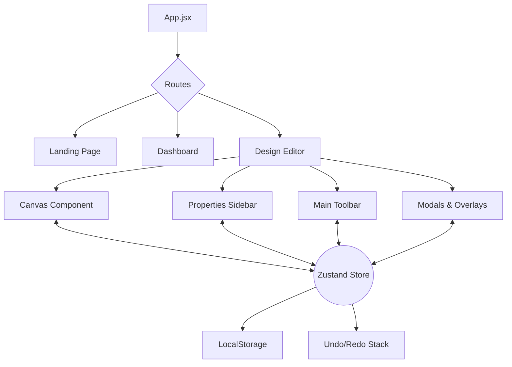
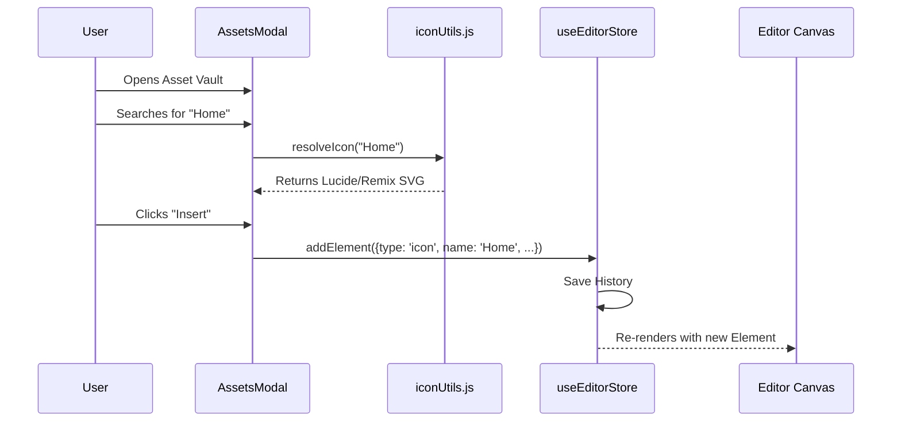
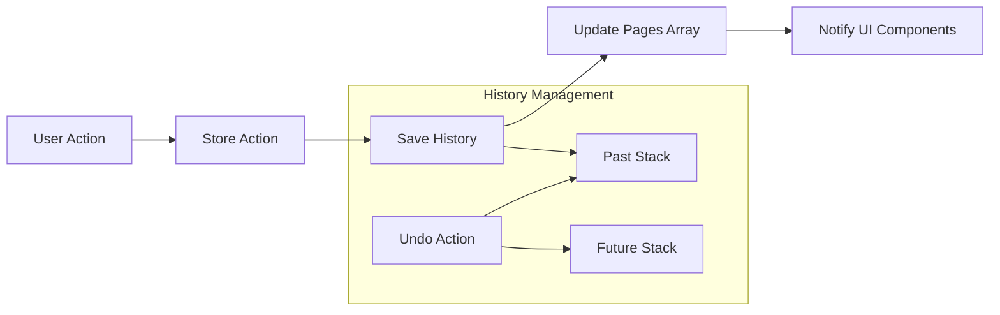

# KRAFT Project Workflow

This document explains the internal architecture and development workflow of the KRAFT Design Editor.

## 🏗️ System Overview

The application follows a centralized state management pattern using **Zustand**. The UI is decoupled from the logic, allowing for a highly responsive and predictable design environment.

## 🎨 Asset Pipeline

KRAFT manages thousands of assets (icons, fonts, shapes) through a unified resolution pipeline.

## 🔄 State & History Flow

The "Heart" of KRAFT is the `useEditorStore`. It manages the document structure and maintains a high-fidelity history stack.

## 🛠️ Development Workflow

1.  **State First**: Define the required state and actions in `useEditorStore.js`.
2.  **Logic Integration**: Implement utility functions in `src/utils/` for complex operations (e.g., coordinate calculations).
3.  **UI Implementation**: Create/Update components in `src/components/` using Tailwind CSS for styling.
4.  **Theme Verification**: Ensure the new feature works across all KRAFT themes (Light, Dark, Gray).
5.  **Documentation**: Update `IMPLEMENTATION_PLAN.md` with the new progress.

---
*Generated by Antigravity AI*
